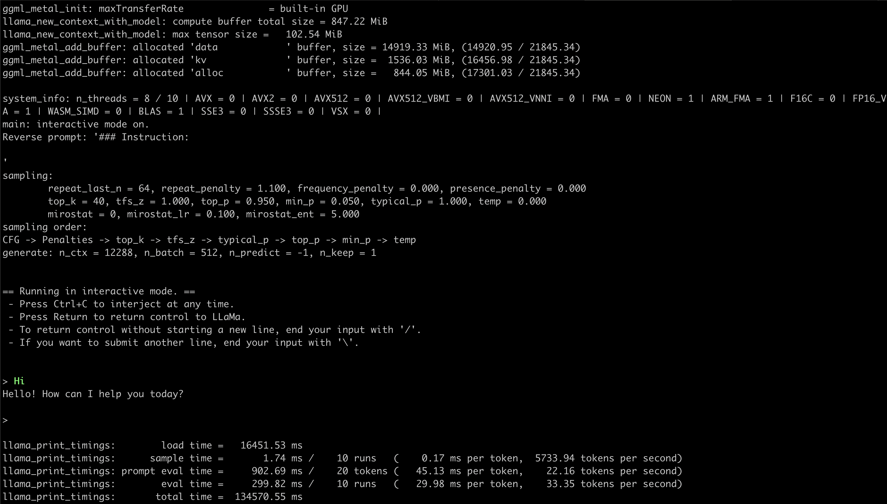

# MixtralMoeWithLLama

A local llama.cpp tool for runing Mixtral 8X7B Instruct v0.1 - GGUF with Q2-K on macOS

```bash
git clone --recursive git@github.com:AtomGradient/MixtralMoeWithLLama.git
cd MixtralMoeWithLLama
# first install relative dependencies
./install.sh # this command may takes a little long time cause downloading large file from 😊huggingface
# after all above is done,run
./run.sh
```


## WE ARE HIRING
refer here: https://daxiang.feishu.cn/docx/LluCd7J38o9U5pxN3kdcpSh6nEh
